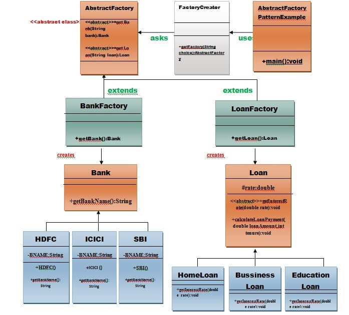

## Output of program and UML

Enter the name of Bank from where you want to take loan amount: icici

Enter the type of loan e.g. home loan or business loan or education loan : business

Enter the interest rate for ICICI BANK: 12

Enter the loan amount you want to take: 2000000

Enter the number of years to pay your entire loan amount: 20

you are taking the loan from ICICI BANK
your monthly EMI is 22021.722671392195 for the amount2000000.0 you have borrowed

## UML

