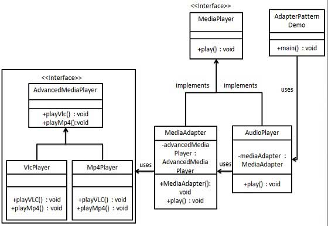

https://www.tutorialspoint.com/design_pattern/adapter_pattern.htm#

## Pattern

An Adapter Pattern says that just "converts the interface of a class into another interface that a client wants".

In other words, to provide the interface according to client requirement while using the services of a class with a different interface.

The Adapter Pattern is also known as Wrapper.

Advantage of Adapter Pattern
It allows two or more previously incompatible objects to interact.
## Image

## UML

## Expaination UML

UML for Adapter Pattern:
There are the following specifications for the adapter pattern:

Target Interface: This is the desired interface class which will be used by the clients.

Adapter class: This class is a wrapper class which implements the desired target interface and modifies the specific request available from the Adaptee class.

Adaptee class: This is the class which is used by the Adapter class to reuse the existing functionality and modify them for desired use.

Client: This class will interact with the Adapter class.